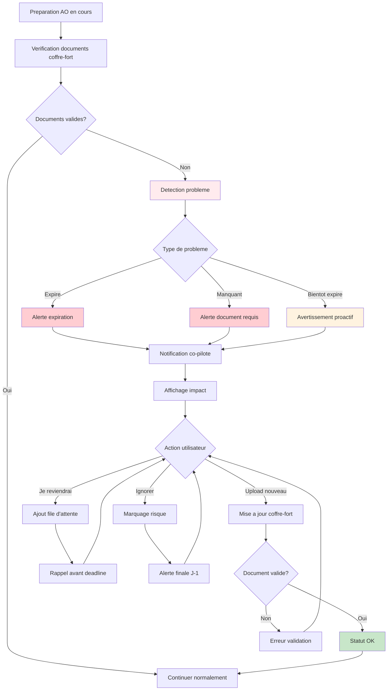
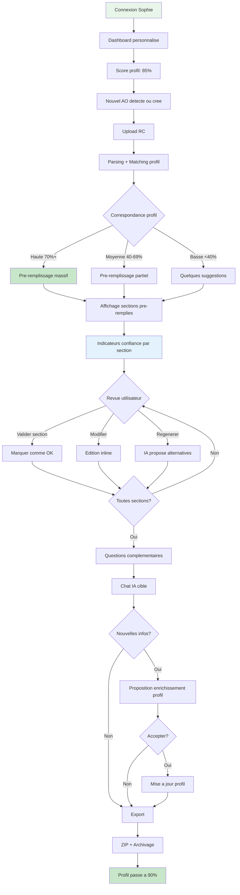

# UX Design Specification appeloffresaas

**Author:** Steeven
**Date:** 2026-01-16

---

## Executive Summary

### Project Vision

appeloffresaas est une plateforme SaaS conversationnelle propulsée par l'IA, conçue pour transformer l'expérience de réponse aux appels d'offres publics français. La vision UX est de créer un co-pilote intelligent qui guide sans imposer, qui mémorise sans surcharger, et qui simplifie sans masquer la complexité inhérente aux marchés publics.

L'expérience utilisateur cible est celle d'un "assistant expert" disponible 24/7 — un professionnel des AO virtuellement présent qui connaît l'entreprise, comprend les exigences du RC, et propose des suggestions pertinentes tout en laissant l'utilisateur maître de chaque décision.

### Target Users

**Persona Principal — Marc (Consultant Indépendant)**

- Profil : Consultant IT, 45 ans, travaille seul
- Contexte : Répond à 6-8 AO/an, temps administratif = temps non-facturable
- Frustration : "Je perds 30h par AO pour de la paperasse, pas pour mon expertise"
- Besoin UX : Interface rapide, mémoire des infos déjà fournies, zéro friction

**Persona Secondaire — Sophie (Dirigeante PME)**

- Profil : Directrice PME BTP, 25 employés, pas de service dédié AO
- Contexte : 10-15 AO/an, gère tout elle-même en plus de son activité
- Frustration : "Un oubli de document = 200k€ perdus pour une bêtise"
- Besoin UX : Checklist infaillible, alertes proactives, export clé en main

**Persona Tertiaire — Thomas (Associé Cabinet Conseil)**

- Profil : Cabinet de conseil 50 personnes, 25-30 AO/an
- Contexte : Équipe dédiée mais processus manuel inefficient
- Frustration : "On passe plus de temps à formater qu'à réfléchir"
- Besoin UX : Templates intelligents, standardisation, gain de productivité

### Key Design Challenges

1. **Équilibre Complexité/Simplicité** — Les AO publics sont réglementés et complexes. L'interface doit guider à travers cette complexité sans la cacher (risque d'erreurs critiques) ni submerger l'utilisateur (abandon).

2. **Confiance dans l'IA** — Les utilisateurs doivent comprendre d'où viennent les suggestions IA, pouvoir les modifier facilement, et avoir confiance que rien de critique n'est oublié. Transparence et contrôle sont essentiels.

3. **Flux Non-Linéaire** — Contrairement à un formulaire séquentiel, la rédaction d'AO est itérative. L'utilisateur doit pouvoir naviguer librement, reporter des questions, y revenir, sans perdre le contexte ou la progression.

4. **Onboarding & Valeur Progressive** — La vraie valeur (mémoire entreprise, réutilisation) n'apparaît qu'au 2ème AO. Comment communiquer cette promesse au premier usage sans décevoir?

5. **Multi-Tâches Cognitif** — L'utilisateur consulte le RC, rédige sa réponse, vérifie ses documents. L'interface doit supporter ce multi-tâches sans surcharge cognitive (d'où l'interface 3 colonnes).

### Design Opportunities

1. **"Wow Moment" au Parsing RC** — Transformer 3 heures de lecture en 5 minutes d'analyse automatique. Premier contact = valeur immédiate et mémorable.

2. **Progression Visuelle Engageante** — Score de complétude, radar des sections, indicateurs colorés (🟢🟡🔴) créent un sentiment de progression et de maîtrise.

3. **Co-Pilote Non-Intrusif** — Panneau de suggestions latéral (jamais de popups), priorisation des alertes, mode focus — l'IA accompagne sans interrompre.

4. **Document "Vivant"** — Preview temps réel qui se construit section par section. L'utilisateur voit son travail prendre forme, ce qui maintient la motivation.

5. **Capitalisation Invisible** — Chaque AO enrichit automatiquement le profil entreprise. L'utilisateur découvre au 2ème AO que ses infos sont déjà là — effet "magique" de la mémoire.

## Core User Experience

### Defining Experience

L'expérience centrale d'appeloffresaas repose sur un paradigme conversationnel : l'utilisateur dialogue avec un agent IA expert des appels d'offres publics. Ce n'est pas un formulaire à remplir, mais une conversation structurée qui guide naturellement vers un dossier complet et conforme.

**Action Core :** Dialoguer avec l'IA pour construire progressivement la réponse AO
**Flux Critique :** Question → Réponse → Validation inline → Génération section document
**Différenciateur Clé :** La mémoire entreprise qui élimine toute re-saisie d'un AO à l'autre

### Platform Strategy

| Dimension     | Choix                                              | Rationale                                                      |
| ------------- | -------------------------------------------------- | -------------------------------------------------------------- |
| Plateforme    | Web SPA (responsive)                               | Travail desktop avec documents, consultation mobile secondaire |
| Interaction   | Souris + clavier prioritaire                       | Rédaction intensive, touch non-prioritaire                     |
| Écran optimal | ≥1280px largeur                                    | Interface 3 colonnes exploite l'espace horizontal              |
| Offline       | Non requis (MVP)                                   | SaaS cloud-first, données sensibles                            |
| Accessibilité | RGAA AA                                            | Obligation secteur public français                             |
| Navigateurs   | Chrome, Firefox, Safari, Edge (dernières versions) | Couverture standard marché français                            |

### Effortless Interactions

**Interactions qui doivent paraître magiques :**

1. **Upload RC → Checklist auto** : Drag & drop du PDF → en 30 secondes, liste structurée des 25+ pièces exigées
2. **Chat → Document temps réel** : L'utilisateur répond, le document se construit sous ses yeux
3. **Mémoire invisible** : "Votre SIRET est..." apparaît sans action — l'IA se souvient
4. **Navigation par modules** : Clic sur "Références" → conversation repositionnée sur ce thème
5. **Sauvegarde transparente** : Aucun bouton Save — tout est persisté automatiquement
6. **Export one-click** : Un bouton → ZIP complet avec nomenclature correcte

**Pain points concurrents que nous éliminons :**

- Templates Word génériques (2h d'adaptation) → Templates auto-adaptés au RC spécifique
- Checklist manuelle (oublis fréquents) → Checklist générée avec suivi automatique
- Re-saisie infos (12h de collecte) → Mémoire entreprise persistante

### Critical Success Moments

| Moment                  | Timing             | Expérience attendue                               | Impact                |
| ----------------------- | ------------------ | ------------------------------------------------- | --------------------- |
| **Premier upload RC**   | T+30s              | "Wow, ça m'aurait pris 3 heures de lire tout ça!" | Conviction immédiate  |
| **Première réponse IA** | T+2min             | "Elle comprend vraiment ce que je veux dire"      | Confiance établie     |
| **Deuxième AO**         | Retour utilisateur | "Elle se souvient de tout!"                       | Fidélisation          |
| **Export final**        | Fin workflow       | "Je n'ai plus qu'à déposer sur la plateforme"     | Satisfaction complète |

**Moments à risque (et mitigation) :**

- Question incomprise → Proposer exemples, reformuler, permettre de passer
- Document manquant → Alerte avec actions (uploader, déléguer, reporter)
- Deadline proche → Notifications progressives, mode priorité

### Experience Principles

**Principes directeurs pour toutes les décisions UX :**

1. **"Conversation, pas formulaire"**
   L'interaction est un dialogue naturel. L'IA pose, écoute, reformule, s'adapte. Jamais de champs obligatoires bloquants ou d'erreurs de validation frustrantes.

2. **"Zéro re-saisie"**
   L'information fournie une fois n'est jamais redemandée. La mémoire entreprise est le super-pouvoir différenciant. Chaque AO enrichit le profil pour le suivant.

3. **"Transparence totale"**
   L'utilisateur sait toujours ce que l'IA fait et pourquoi. Sources visibles, suggestions explicables, indicateurs de confiance affichés.

4. **"Jamais bloqué"**
   L'utilisateur peut toujours avancer. Questions reportables, file d'attente intelligente, réconciliation finale. Flexibilité maximale dans le parcours.

5. **"Document vivant"**
   La preview se construit en temps réel. L'utilisateur voit son travail prendre forme section par section. Gratification immédiate et continue.

6. **"Expert accessible"**
   La complexité réglementaire des AO est maîtrisée par l'IA et simplifiée pour l'utilisateur. Guidance sans jargon, expertise sans intimidation.

## Desired Emotional Response

### Primary Emotional Goals

L'expérience appeloffresaas doit générer une progression émotionnelle positive qui transforme l'anxiété initiale liée aux AO en sentiment de maîtrise et de fierté professionnelle.

**Émotions primaires visées :**

1. **Soulagement** — "Ce n'est plus une montagne insurmontable"
   - Déclencheur : Parsing RC automatique, checklist claire
   - Design : Présentation calme des résultats, pas d'urgence artificielle

2. **Confiance** — "Je sais que rien ne sera oublié"
   - Déclencheur : Indicateurs visuels, validation inline, checklist exhaustive
   - Design : Transparence totale, sources visibles, contrôle utilisateur

3. **Maîtrise** — "Je contrôle ce processus, je ne le subis pas"
   - Déclencheur : Navigation libre, progression visible, questions reportables
   - Design : Carte de conversation, fil d'ariane, flexibilité maximale

4. **Fierté** — "J'ai produit un dossier professionnel"
   - Déclencheur : Export final de qualité, document bien formaté
   - Design : Templates soignés, mise en page professionnelle

### Emotional Journey Mapping

| Phase      | État initial          | Transformation         | État final              |
| ---------- | --------------------- | ---------------------- | ----------------------- |
| Découverte | Scepticisme           | Démonstration valeur   | Curiosité engagée       |
| Onboarding | Appréhension          | Simplicité surprenante | Soulagement             |
| Premier AO | Concentration         | Accompagnement fluide  | Confiance               |
| Export     | Anticipation anxieuse | Checklist complète     | Fierté                  |
| Retour     | Neutralité            | Mémoire magique        | Enchantement fidélisant |

### Micro-Emotions

**États émotionnels à cultiver :**

- Confiance vs Scepticisme → Transparence IA, indicateurs de confiance
- Maîtrise vs Confusion → Navigation claire, progression visible
- Calme vs Anxiété → Tons rassurants, pas d'alertes alarmistes
- Accomplissement vs Frustration → Micro-célébrations, gamification douce
- Autonomie vs Dépendance → Suggestions, jamais impositions

**Moments de micro-délice :**

- Animation subtile à chaque section complétée
- Transition douce vers la preview document
- Badge ou confetti discret à 100% checklist
- Message personnalisé au retour utilisateur

### Design Implications

**Palette émotionnelle :**

- Couleur dominante : Bleu (confiance, professionnalisme)
- Accent positif : Vert (validation, succès)
- Attention : Orange (attention douce, pas alarmiste)
- Erreur critique : Rouge (usage minimal, uniquement blocages réels)

**Tonalité de l'IA :**

- Professionnelle mais chaleureuse
- Rassurante sans être condescendante
- Proactive sans être intrusive
- Expert accessible, pas jargonnant

**Feedback utilisateur :**

- Toujours positif d'abord ("Section méthodologie bien avancée!")
- Corrections présentées comme améliorations possibles
- Jamais de message d'erreur sans solution proposée

### Emotional Design Principles

1. **"Transformation émotionnelle positive"**
   Chaque interaction doit faire passer l'utilisateur d'un état moins positif vers un état plus positif. Anxiété → Soulagement. Confusion → Clarté. Doute → Confiance.

2. **"Célébrer les progrès"**
   Micro-feedback positif à chaque avancement. L'utilisateur ne doit jamais avoir l'impression de "ramer" sans avancer.

3. **"Jamais seul face au problème"**
   Le co-pilote IA est toujours présent avec une suggestion, une aide, une direction. Pas de cul-de-sac émotionnel.

4. **"Transparence = Confiance"**
   Chaque action IA est explicable. L'utilisateur peut toujours comprendre pourquoi et modifier. Pas de magie noire.

5. **"Calme professionnel"**
   L'interface respire la sérénité. Pas de stress artificiel, pas de compte à rebours anxiogène, pas de rouge inutile. Le stress est dans l'AO, pas dans l'outil.

## UX Pattern Analysis & Inspiration

### Inspiring Products Analysis

**Produits analysés pour leur pertinence UX :**

| Produit            | Pertinence                              | Pattern principal retenu                    |
| ------------------ | --------------------------------------- | ------------------------------------------- |
| **ChatGPT/Claude** | Interface conversationnelle IA          | Streaming réponse, historique conversations |
| **Notion**         | Workspace flexible et modulaire         | Sidebar navigation, inline editing, blocs   |
| **Linear**         | SaaS B2B moderne et performant          | États visuels, raccourcis, design épuré     |
| **Typeform**       | Expérience formulaire conversationnelle | Focus mono-question, progression douce      |
| **Grammarly**      | Co-pilote d'écriture non-intrusif       | Suggestions latérales, score qualité        |

**Synthèse des forces combinées :**

- ChatGPT pour l'expérience conversationnelle
- Notion pour la flexibilité et la structure
- Linear pour l'efficacité et le design professionnel
- Typeform pour la progression engageante
- Grammarly pour le co-pilotage discret

### Transferable UX Patterns

**Patterns de navigation adoptés :**

1. **Sidebar modulaire** (Notion)
   - Liste des modules AO : Entreprise, Références, Méthodologie, Offre financière
   - Indicateurs d'état par module (🟢🟡🔴)
   - Collapsible pour maximiser l'espace

2. **Fil d'ariane contextuel** (Linear)
   - Position dans la conversation : "AO Hôpital Lyon > Section Méthodologie > Question 3/8"
   - Retour rapide à n'importe quel niveau

3. **Omni-search Cmd+K** (Linear)
   - Recherche universelle : sections, documents, AO passés, aide
   - Navigation clavier pour power users

**Patterns d'interaction adoptés :**

1. **Streaming de réponse** (ChatGPT)
   - Réponses IA affichées progressivement
   - Indicateur "L'IA réfléchit..." pendant l'analyse
   - Bouton stop si génération trop longue

2. **Inline editing** (Notion)
   - Clic sur n'importe quelle section générée → édition directe
   - Pas de modal, modification en place
   - Historique des versions accessible

3. **Drag & drop intelligent** (Figma)
   - Upload RC par glisser-déposer
   - Upload documents dans le coffre-fort
   - Réorganisation sections si nécessaire

**Patterns de feedback adoptés :**

1. **Indicateurs d'état visuels** (Linear)
   - 🟢 Section complète et validée
   - 🟡 Section en cours ou à vérifier
   - 🔴 Section manquante ou problème
   - Badges cohérents dans toute l'interface

2. **Progression visuelle** (Typeform)
   - Jauge globale de complétude du dossier (ex: 67%)
   - Progression par module visible dans sidebar
   - Célébration subtile à 100%

3. **Toast notifications** (Notion)
   - Confirmations discrètes en bas d'écran
   - Auto-dismiss après 3 secondes
   - Jamais bloquantes

**Patterns d'aide adoptés :**

1. **Panneau co-pilote latéral** (Grammarly)
   - Suggestions contextuelles non-bloquantes
   - Priorisation : 🔴 Critique > 🟡 Recommandé > 🟢 Optimisation
   - Collapsible, mode focus pour le masquer

2. **Tooltips explicatifs** (Figma)
   - Termes AO expliqués au survol
   - Pas de jargon sans explication disponible
   - Aide contextuelle toujours accessible

### Anti-Patterns to Avoid

**Interactions à proscrire :**

| Anti-Pattern               | Alternative adoptée                   |
| -------------------------- | ------------------------------------- |
| Popups modaux bloquants    | Panneaux latéraux coulissants         |
| Formulaires multi-pages    | Conversation fluide continue          |
| Validation rouge agressive | Feedback positif + suggestions douces |
| Bouton "Sauvegarder"       | Sauvegarde automatique silencieuse    |
| Loading spinners > 2s      | Streaming, squelettes de chargement   |
| Wizard linéaire strict     | Navigation libre avec fil d'ariane    |

**Design à éviter :**

| Anti-Pattern                | Alternative adoptée                            |
| --------------------------- | ---------------------------------------------- |
| Interface surchargée        | Espaces blancs généreux, focus essentiel       |
| Arborescence > 2 niveaux    | Structure plate avec recherche                 |
| Jargon non expliqué         | Tooltips systématiques                         |
| Notifications invasives     | Toast discrets, priorités filtrables           |
| Couleurs alarmistes partout | Rouge réservé aux erreurs critiques uniquement |

### Design Inspiration Strategy

**Ce que nous adoptons directement :**

- Streaming de réponse IA (ChatGPT)
- Sidebar modulaire avec indicateurs (Notion + Linear)
- Inline editing pour le document (Notion)
- Indicateurs d'état colorés cohérents (Linear)
- Panneau suggestions latéral (Grammarly)

**Ce que nous adaptons :**

- Focus mono-question de Typeform → adapté pour dialogue plus fluide
- Cmd+K de Linear → enrichi avec recherche dans AO passés
- Blocs Notion → sections AO avec structure contrainte (conformité)

**Ce que nous évitons consciemment :**

- Complexité de Notion (trop de liberté pour un outil métier)
- Minimalisme extrême de Linear (besoin de guidage pour novices)
- Gamification excessive de Typeform (contexte professionnel)

**Positionnement UX unique :**
appeloffresaas combine la fluidité conversationnelle de ChatGPT, la structure modulaire de Notion, l'efficacité professionnelle de Linear, et le co-pilotage discret de Grammarly — le tout adapté aux contraintes spécifiques des appels d'offres publics français.

## Design System Foundation

### Design System Choice

**Système choisi : shadcn/ui + Radix UI + Tailwind CSS**

shadcn/ui est une collection de composants réutilisables construits sur Radix UI (primitives accessibles) et stylés avec Tailwind CSS. Contrairement aux design systems traditionnels, shadcn/ui n'est pas un package npm — les composants sont copiés dans le projet, offrant un contrôle total sur le code et le styling.

**Stack Design System complet :**

- **Primitives accessibles** : Radix UI
- **Styling** : Tailwind CSS
- **Composants UI** : shadcn/ui
- **Icônes** : Lucide Icons (cohérent shadcn)
- **Animations** : Framer Motion (micro-interactions)
- **Thème** : CSS Variables + Tailwind config

### Rationale for Selection

**1. Alignement avec les inspirations UX**

- Design épuré et moderne aligné avec Linear et Notion
- Composants qui supportent les patterns identifiés (sidebar, toasts, command palette)

**2. Accessibilité RGAA AA native**

- Radix UI fournit des primitives accessibles par défaut
- Focus management, keyboard navigation, ARIA attributes inclus
- Réduit le risque de non-conformité

**3. Personnalisation maximale**

- Composants copiés dans `/components/ui`
- Modification directe du code, pas de contrainte de librairie
- Adaptation parfaite à l'identité visuelle appeloffresaas

**4. Performance optimale**

- Pas de runtime CSS-in-JS
- Tree-shaking parfait (on n'importe que ce qu'on utilise)
- Bundle size minimal

**5. Expérience développeur**

- CLI pour ajouter des composants (`npx shadcn-ui@latest add button`)
- Documentation excellente
- TypeScript natif

### Implementation Approach

**Phase 1 : Setup initial**

```bash
npx create-next-app@latest appeloffresaas --typescript --tailwind --app
npx shadcn-ui@latest init
```

**Phase 2 : Composants de base**

- Button, Input, Textarea, Select (formulaires)
- Dialog, Sheet, Popover (overlays)
- Toast, Alert (feedback)
- Sidebar, Navigation (structure)

**Phase 3 : Composants métier**

- ChatMessage (bulle de conversation)
- DocumentSection (section du dossier AO)
- ModuleCard (carte de module avec indicateur)
- ProgressRing (jauge de complétude)

**Structure fichiers :**

```
/components
  /ui              # Composants shadcn/ui (copiés)
    button.tsx
    input.tsx
    dialog.tsx
    ...
  /features        # Composants métier appeloffresaas
    chat-message.tsx
    document-section.tsx
    module-card.tsx
    ...
  /layout          # Composants de structure
    sidebar.tsx
    header.tsx
    three-column-layout.tsx
```

### Customization Strategy

**1. Design Tokens (CSS Variables)**

```css
:root {
  /* Couleurs principales */
  --primary: 221.2 83.2% 53.3%; /* Bleu confiance */
  --primary-foreground: 210 40% 98%;

  /* États */
  --success: 142.1 76.2% 36.3%; /* Vert validation */
  --warning: 38 92% 50%; /* Orange attention */
  --destructive: 0 84.2% 60.2%; /* Rouge erreur critique */

  /* Surfaces */
  --background: 0 0% 100%;
  --foreground: 222.2 84% 4.9%;
  --muted: 210 40% 96%;
  --card: 0 0% 100%;

  /* Bordures et accents */
  --border: 214.3 31.8% 91.4%;
  --ring: 221.2 83.2% 53.3%;

  /* Rayons */
  --radius: 0.5rem;
}
```

**2. Composants shadcn/ui à personnaliser**

| Composant | Personnalisation                                   |
| --------- | -------------------------------------------------- |
| Button    | Variantes : primary, secondary, ghost, destructive |
| Input     | Style chat input avec bouton send intégré          |
| Card      | Module cards avec indicateur d'état intégré        |
| Sheet     | Panneau co-pilote latéral                          |
| Command   | Omni-search Cmd+K                                  |
| Progress  | Jauge de complétude circulaire                     |
| Toast     | Style discret, auto-dismiss                        |

**3. Composants custom à créer**

| Composant             | Description                                   |
| --------------------- | --------------------------------------------- |
| `ChatBubble`          | Message utilisateur/IA avec avatar, timestamp |
| `StreamingText`       | Texte qui s'affiche progressivement           |
| `StatusBadge`         | 🟢🟡🔴 avec tooltip explicatif                |
| `ModuleNav`           | Item de sidebar avec indicateur + collapse    |
| `DocumentPreview`     | Preview du document avec sections cliquables  |
| `FileDropzone`        | Zone de drop pour RC/documents                |
| `ConfidenceIndicator` | Jauge de confiance IA                         |

**4. Dark Mode**

Support dark mode natif via Tailwind + CSS variables :

- Toggle dans les settings utilisateur
- Respect des préférences système (`prefers-color-scheme`)
- Tokens adaptés pour chaque mode

## Defining User Experience

### The Defining Experience

**L'expérience signature d'appeloffresaas :**

> "Converser avec un expert IA qui construit mon dossier AO en temps réel"

Cette interaction centrale combine trois éléments différenciants :

1. **Conversation naturelle** — L'utilisateur parle comme à un consultant
2. **Génération temps réel** — Le document se construit visiblement pendant la conversation
3. **Mémoire persistante** — L'IA se souvient de tout, d'un AO à l'autre

**Pitch utilisateur :**
"Tu parles avec l'IA comme avec un expert AO. Elle pose les bonnes questions, reformule tes réponses de façon professionnelle, et le document se remplit sous tes yeux. Au deuxième AO, elle se souvient de tout — plus besoin de retaper."

### User Mental Model

**Modèle mental existant :**
Les utilisateurs arrivent avec l'image mentale de "remplir un dossier administratif" — une tâche répétitive, anxiogène, où l'erreur coûte cher.

**Modèle mental cible :**
Transformer cette perception en "collaborer avec un expert" — une conversation productive où l'utilisateur apporte son expertise métier et l'IA structure la conformité.

**Transition du modèle mental :**

| De...                   | Vers...                          |
| ----------------------- | -------------------------------- |
| Formulaire à remplir    | Conversation avec un expert      |
| Checklist à cocher      | Progression visuelle engageante  |
| Copier-coller répétitif | Mémoire qui travaille pour moi   |
| Peur de l'oubli         | Confiance dans la checklist auto |
| Document figé           | Document vivant qui évolue       |

### Success Criteria

**Critères de succès de l'expérience core :**

1. **Fluidité conversationnelle**
   - L'utilisateur ne se sent pas "interrogé" mais "accompagné"
   - Les questions s'enchaînent naturellement
   - Possibilité de digression et retour au fil principal

2. **Génération perçue comme magique**
   - Le document apparaît section par section pendant la conversation
   - Qualité professionnelle dès la première génération
   - Édition facile si ajustement nécessaire

3. **Confiance établie rapidement**
   - Parsing RC démontre la valeur en < 1 minute
   - Reformulations justes dès les premières réponses
   - Transparence sur ce que l'IA fait et pourquoi

4. **Mémorisation perçue au 2ème usage**
   - Données pré-remplies sans action
   - Message explicite "Je me souviens de votre CA 2025"
   - Temps de complétion visiblement réduit

5. **Zéro anxiété à l'export**
   - Checklist 100% verte avant export
   - Réconciliation des points en suspens
   - Dossier complet, correctement structuré

### Novel UX Patterns

**Patterns innovants spécifiques à appeloffresaas :**

1. **Chat-to-Document Synchronisé**
   Contrairement à ChatGPT (chat seul) ou Google Docs (document seul), appeloffresaas synchronise conversation et document en temps réel. L'utilisateur voit le lien direct entre ce qu'il dit et ce qui apparaît.

2. **Mémoire Entreprise Cross-Session**
   Innovation par rapport aux outils existants : la connaissance persiste entre les sessions et les projets. Chaque AO enrichit le profil pour le suivant.

3. **Parsing Réglementaire Spécialisé**
   Capacité unique à analyser les Règlements de Consultation (RC) et extraire automatiquement les exigences. Aucun concurrent généraliste ne propose cette spécialisation.

4. **File d'Attente de Questions**
   Pattern UX permettant de reporter des questions sans bloquer le flux. L'IA empile les questions non répondues et les repropose au moment opportun.

**Éducation utilisateur requise :**

- Onboarding guidé au premier AO
- Tooltips explicatifs sur les fonctionnalités nouvelles
- "Effet magique" délibéré au 2ème AO pour ancrer la valeur de la mémoire

### Experience Mechanics

**Flux détaillé de l'expérience core :**

**Phase 1 : Initiation**

```
[Utilisateur] Clique "Nouvel AO"
     ↓
[Système] Affiche modal : "Commençons votre nouvel appel d'offres"
     ↓
[Utilisateur] Upload RC (drag & drop) OU description textuelle
     ↓
[Système] Parsing RC avec animation de lecture
     ↓
[Système] Affiche checklist générée : "J'ai identifié 28 pièces requises"
     ↓
[IA] "Parfait ! Commençons par les informations de votre entreprise..."
```

**Phase 2 : Interaction**

```
[IA] Pose une question contextuelle
     ↓
[Utilisateur] Répond (texte, choix, ou "Je reviendrai")
     ↓
[IA] Reformule et demande validation
     ↓
[Utilisateur] Confirme ou corrige
     ↓
[Système] Génère section document (streaming visible)
     ↓
[Système] Met à jour indicateurs (module 🟢, jauge +5%)
     ↓
[IA] Passe à la question suivante ou propose un détour
```

**Phase 3 : Feedback continu**

```
[Système] Mise à jour temps réel :
  - Jauge de complétude globale
  - Indicateurs par module (🟢🟡🔴)
  - Preview document synchronisé
  - Suggestions co-pilote dans panneau latéral
```

**Phase 4 : Completion**

```
[Système] Détecte checklist proche de 100%
     ↓
[IA] "Excellente progression ! Il reste 3 points à clarifier..."
     ↓
[IA] Session de réconciliation (questions en file d'attente)
     ↓
[Système] Checklist 100% → Bouton Export activé
     ↓
[Utilisateur] Clique Export
     ↓
[Système] Génère ZIP avec aperçu du contenu
     ↓
[IA] "Votre dossier est prêt. Bonne chance pour cet AO !"
```

---

## 7. Visual Design Foundation

### 7.1 Color System — "Professional Trust"

**Palette Principale**

| Token                  | HSL         | Hex     | Usage                             |
| ---------------------- | ----------- | ------- | --------------------------------- |
| `--primary`            | 221 83% 53% | #3B82F6 | Actions principales, liens, focus |
| `--primary-foreground` | 210 40% 98% | #F8FAFC | Texte sur primary                 |
| `--success`            | 142 76% 36% | #22C55E | Validations, complétude           |
| `--warning`            | 38 92% 50%  | #F59E0B | Alertes, expirations              |
| `--destructive`        | 0 84% 60%   | #EF4444 | Erreurs, suppressions             |

**Neutrals (Zinc)**

| Token                | HSL         | Usage             |
| -------------------- | ----------- | ----------------- |
| `--background`       | 0 0% 100%   | Fond principal    |
| `--foreground`       | 224 71% 4%  | Texte principal   |
| `--muted`            | 220 14% 96% | Fonds secondaires |
| `--muted-foreground` | 220 9% 46%  | Texte désactivé   |
| `--border`           | 220 13% 91% | Bordures          |
| `--ring`             | 221 83% 53% | Focus rings       |

**Indicateurs de Statut**

```
🟢 Complet    : --success (#22C55E)
🟡 En cours   : --warning (#F59E0B)
🔴 Manquant   : --destructive (#EF4444)
⚪ Non démarré : --muted-foreground
```

### 7.2 Typography System

**Font Stack**

```css
--font-sans: "Inter", -apple-system, BlinkMacSystemFont, sans-serif;
--font-mono: "JetBrains Mono", "Fira Code", monospace;
```

**Échelle Typographique**

| Token       | Taille | Line Height | Usage                   |
| ----------- | ------ | ----------- | ----------------------- |
| `text-xs`   | 12px   | 16px        | Labels, badges          |
| `text-sm`   | 14px   | 20px        | Corps secondaire, hints |
| `text-base` | 16px   | 24px        | Corps principal         |
| `text-lg`   | 18px   | 28px        | Sous-titres             |
| `text-xl`   | 20px   | 28px        | Titres sections         |
| `text-2xl`  | 24px   | 32px        | Titres pages            |
| `text-3xl`  | 30px   | 36px        | Héros                   |

**Font Weights**

| Weight         | Usage                    |
| -------------- | ------------------------ |
| 400 (Regular)  | Corps, descriptions      |
| 500 (Medium)   | Labels, boutons          |
| 600 (SemiBold) | Titres, emphase          |
| 700 (Bold)     | Héros, alertes critiques |

### 7.3 Spacing & Layout Foundation

**Base Unit: 4px**

```css
--space-1: 4px; /* micro-ajustements */
--space-2: 8px; /* entre éléments liés */
--space-3: 12px; /* padding interne compact */
--space-4: 16px; /* gap standard */
--space-5: 20px; /* padding sections */
--space-6: 24px; /* séparation groupes */
--space-8: 32px; /* margin sections */
--space-10: 40px; /* espacement majeur */
--space-12: 48px; /* header height */
--space-16: 64px; /* grand espacement */
```

**Layout Structure — 3 Colonnes**

```
┌──────────────────────────────────────────────────────────────────┐
│ Header (h: 56px, fixed)                                          │
├─────────────┬──────────────────────────────────────┬────────────┤
│             │                                      │            │
│  Sidebar    │     Zone Centrale                    │  Panneau   │
│  Navigation │     (flex: 1)                        │  Co-pilote │
│  & Modules  │                                      │  Contextuel│
│             │                                      │            │
│  w: 280px   │  min: 480px, max: 960px              │  w: 320px  │
│  fixed      │  padding: 24px                       │  collapsible│
│             │                                      │            │
└─────────────┴──────────────────────────────────────┴────────────┘
```

**Breakpoints**

| Token | Valeur      | Comportement              |
| ----- | ----------- | ------------------------- |
| `xl`  | ≥1440px     | 3 colonnes complètes      |
| `lg`  | 1280-1439px | Co-pilote en overlay      |
| `md`  | 1024-1279px | Sidebar collapsible       |
| `sm`  | 768-1023px  | Single column + drawer    |
| `xs`  | <768px      | Mobile, navigation bottom |

### 7.4 Accessibility Considerations

**RGAA AA Compliance**

| Critère             | Implémentation                         |
| ------------------- | -------------------------------------- |
| Contraste texte     | Min 4.5:1 (corps), 3:1 (large)         |
| Contraste UI        | Min 3:1 pour composants interactifs    |
| Focus visible       | Ring 2px, offset 2px, couleur `--ring` |
| Zones cliquables    | Min 44x44px sur mobile                 |
| Navigation clavier  | Tab order logique, skip links          |
| Screen readers      | aria-labels, live regions              |
| Réduction mouvement | `prefers-reduced-motion` respecté      |

**Design Tokens Accessibilité**

```css
/* Focus states */
--ring-width: 2px;
--ring-offset: 2px;

/* Transitions (respectent reduced-motion) */
--transition-fast: 150ms ease;
--transition-base: 200ms ease;
--transition-slow: 300ms ease;

/* Border radius */
--radius: 0.5rem; /* 8px - composants standards */
--radius-sm: 0.375rem; /* 6px - badges, chips */
--radius-lg: 0.75rem; /* 12px - cartes, modales */
--radius-full: 9999px; /* avatars, toggles */
```

---

## 8. Design Directions

### 8.1 Mockups Interactifs

Un visualiseur HTML interactif a ete cree pour explorer 8 directions de design differentes :

**Fichier :** `ux-design-directions.html`

### 8.2 Directions Proposees

| #   | Nom                    | Description                                           | Recommandation  |
| --- | ---------------------- | ----------------------------------------------------- | --------------- |
| 1   | **Professional Trust** | Palette bleue classique, fond clair, accents bleus    | **Recommandee** |
| 2   | Dark Professional      | Mode sombre elegant, fatigue oculaire reduite         | Alternative     |
| 3   | Soft Enterprise        | Indigo doux sur gris neutre, sophistication corporate | Alternative     |
| 4   | Warm Trustworthy       | Tons chauds ambre avec accents cyan                   | Differenciant   |
| 5   | Minimal Monochrome     | Noir et blanc avec couleurs minimales                 | Epure           |
| 6   | Government Blue        | Bleu institutionnel style Etat francais               | Secteur public  |
| 7   | Modern Gradient        | Violet avec touches de gradient                       | Moderne         |
| 8   | High Contrast          | Contraste eleve, RGAA AAA                             | Accessibilite   |

### 8.3 Direction Retenue

**Direction 1 : Professional Trust** est recommandee pour les raisons suivantes :

1. **Familiarite** — Palette bleue universellement associee a la confiance et au professionnalisme
2. **Lisibilite** — Contraste optimal sans fatiguer les yeux lors de sessions prolongees
3. **Neutralite** — Convient aussi bien aux grandes entreprises qu'aux independants
4. **Compatibilite** — S'integre bien avec les chartes graphiques des marches publics
5. **Accessibilite** — Conformite RGAA AA native

### 8.4 Elements Cles du Design

```
Interface 3 colonnes :
┌─────────────────────────────────────────────────────────────┐
│ Header : Logo + Navigation principale + Actions utilisateur │
├────────────┬─────────────────────────────┬─────────────────┤
│  Sidebar   │     Zone Centrale           │   Co-pilote     │
│  280px     │     Chat IA + Input         │   320px         │
│  - Progress│     - Messages              │   - Suggestions │
│  - Modules │     - Zone de saisie        │   - Preview     │
│  - Statuts │                             │   - Alertes     │
└────────────┴─────────────────────────────┴─────────────────┘
```

**Composants Principaux :**

- Chat conversationnel avec bulles differenciees (IA/Utilisateur)
- Indicateurs de progression par section (🟢🟡🔴)
- Jauge de completude globale avec pourcentage
- Panneau co-pilote avec suggestions contextuelles
- Preview document en temps reel

---

## 9. User Journey Flows

### 9.1 Journey 1 : Premier AO (Happy Path)

**Objectif :** Marc cree sa premiere reponse AO avec l'application
**Entree :** Decouverte d'un AO interessant, connexion a l'application
**Sortie :** Dossier ZIP complet telecharge

```mermaid
flowchart TD
    A[Connexion / Inscription] --> B{Profil existe?}
    B -->|Non| C[Onboarding rapide]
    B -->|Oui| D[Dashboard]
    C --> D

    D --> E[Clic "Nouvel AO"]
    E --> F[Upload RC / AAPC]
    F --> G[IA parse le document]
    G --> H[Affichage checklist auto-generee]

    H --> I[Chat IA demarre]
    I --> J{Question IA}
    J --> K[Utilisateur repond]
    K --> L[IA reformule + validation]
    L --> M{Valide?}
    M -->|Non| K
    M -->|Oui| N[Section document generee]
    N --> O{Toutes sections?}
    O -->|Non| J
    O -->|Oui| P[Session reconciliation]

    P --> Q[Questions en file d'attente]
    Q --> R{Points resolus?}
    R -->|Non| Q
    R -->|Oui| S[Checklist 100%]

    S --> T[Validation finale]
    T --> U[Generation ZIP]
    U --> V[Telechargement]
    V --> W[Proposition archivage]
    W --> X[Fin - Succes]

    style A fill:#e8f5e9
    style X fill:#c8e6c9
    style G fill:#fff3e0
    style N fill:#e3f2fd
```

**Points de decision critiques :**

1. Upload RC → Parsing reussi ou echec (fallback saisie manuelle)
2. Validation reformulation → Boucle jusqu'a accord
3. Session reconciliation → Gestion des questions differees

**Moments de satisfaction :**

- Checklist auto-generee apres upload RC
- Premiere section document visible en temps reel
- Jauge passant a 100%

### 9.2 Journey 2 : Document Manquant/Expirant (Edge Case)

**Objectif :** L'application detecte proactivement un probleme de document
**Entree :** Utilisateur en cours de preparation AO
**Sortie :** Probleme resolu ou escalade claire



**Niveaux d'alerte :**

- 🔴 **Critique** : Document expire avant date soumission
- 🟡 **Avertissement** : Document expire dans < 30 jours
- 🟢 **Info** : Document a renouveler bientot

**Mecanisme de recovery :**

1. Detection automatique lors du parsing RC
2. Verification croisee avec coffre-fort
3. Notification non-bloquante (panneau co-pilote)
4. Actions claires : Upload, Differer, Ignorer (avec risque affiche)

### 9.3 Journey 3 : Utilisateur Recurrent (Profil Enrichi)

**Objectif :** Sophie utilise son profil existant pour accelerer un nouvel AO
**Entree :** Connexion utilisateur avec profil complete a 85%+
**Sortie :** AO prepare en temps record grace a la reutilisation



**Mecanismes de reutilisation :**

1. **Matching semantique** : RC analyse vs donnees profil
2. **Score de confiance** : 🟢 90%+ / 🟡 60-89% / 🔴 <60% par section
3. **Differences surlignees** : Ce qui a ete adapte vs source
4. **Capture post-AO** : Nouvelles infos detectees → enrichissement profil

### 9.4 Journey Patterns

**Patterns de Navigation :**

| Pattern                    | Description                       | Usage                        |
| -------------------------- | --------------------------------- | ---------------------------- |
| **Progressive Disclosure** | Information revelee par etapes    | Chat IA, sections document   |
| **Breadcrumb Contextuel**  | Fil d'ariane clickable            | Navigation entre modules     |
| **Quick Actions**          | Actions rapides en contexte       | Edition inline, regeneration |
| **Retour au tronc**        | Apres un detour, retour explicite | Questions differees          |

**Patterns de Decision :**

| Pattern           | Description                         | Usage                    |
| ----------------- | ----------------------------------- | ------------------------ |
| **Binary Choice** | Oui/Non avec consequences claires   | Validation reformulation |
| **Multi-option**  | 2-4 choix avec descriptions         | Type de reponse, ton     |
| **Defer Action**  | "Je reviendrai plus tard"           | Questions complexes      |
| **Smart Default** | Option recommandee pre-selectionnee | Suggestions IA           |

**Patterns de Feedback :**

| Pattern                  | Description                    | Usage                 |
| ------------------------ | ------------------------------ | --------------------- |
| **Streaming Generation** | Texte apparait progressivement | Generation sections   |
| **Status Indicators**    | 🟢🟡🔴 codes couleur           | Progression modules   |
| **Progress Bar**         | Jauge numerique + visuelle     | Completude globale    |
| **Inline Validation**    | Confirmation immediate         | Reponses chat         |
| **Non-blocking Alerts**  | Panneau lateral, pas de modal  | Suggestions co-pilote |

### 9.5 Flow Optimization Principles

**Minimisation des etapes vers la valeur :**

- Upload RC → Checklist visible en < 30 secondes
- Premiere question IA en < 5 secondes apres upload
- Preview document des la premiere reponse

**Reduction de la charge cognitive :**

- Maximum 4 options par question
- Questions hybrides (choix puis ouverture si "Autre")
- Suggestions de demarrage pour reponses ouvertes

**Feedback et progression clairs :**

- Jauge globale toujours visible
- Indicateurs par module actualises en temps reel
- Celebration discrete a 100% (confetti subtil)

**Gestion des erreurs gracieuse :**

- Jamais de blocage complet
- Toujours une action alternative
- Explication claire de l'impact des lacunes

---

## 10. Component Strategy

### 10.1 Design System Components (shadcn/ui)

**Composants Fondation Disponibles :**

| Catégorie        | Composants                                                       | Usage appeloffresaas               |
| ---------------- | ---------------------------------------------------------------- | ---------------------------------- |
| **Forms**        | Button, Input, Textarea, Select, Checkbox, Radio, Switch, Slider | Saisie chat, formulaires profil    |
| **Data Display** | Badge, Card, Table, Avatar, Progress                             | Indicateurs statut, cartes modules |
| **Feedback**     | Alert, Toast, Skeleton, Spinner                                  | Notifications, chargement          |
| **Overlay**      | Dialog, Sheet, Popover, Tooltip, DropdownMenu                    | Modales, panneaux latéraux         |
| **Navigation**   | Tabs, Breadcrumb, NavigationMenu                                 | Navigation modules, fil d'ariane   |
| **Layout**       | Separator, ScrollArea, Resizable                                 | Structure 3 colonnes               |

**Évaluation Couverture :**

- **Couverture estimée :** 65% des besoins
- **Composants manquants :** Chat bubbles, Progress indicators spécifiques, Document preview, Co-pilot panel

### 10.2 Custom Components

#### ChatBubble

**Purpose :** Afficher les messages de conversation IA/Utilisateur
**Usage :** Zone centrale de chat

```
┌─────────────────────────────────────────┐
│ [Avatar]  ┌─────────────────────────┐   │
│           │ Message content         │   │
│           │ with markdown support   │   │
│           └─────────────────────────┘   │
│           12:34 · En cours de saisie... │
└─────────────────────────────────────────┘
```

**States :**

| State     | Description                                        |
| --------- | -------------------------------------------------- |
| Default   | Message affiché normalement                        |
| Streaming | Texte apparaît progressivement (animation curseur) |
| Pending   | Message utilisateur en attente de confirmation     |
| Error     | Message non envoyé (avec retry)                    |

**Variants :**

- `assistant` : Aligné gauche, fond muted, avatar IA
- `user` : Aligné droite, fond primary, avatar utilisateur
- `system` : Centré, fond warning/info, pas d'avatar

**Accessibility :**

- `role="log"` sur le conteneur
- `aria-live="polite"` pour nouveaux messages
- Navigation clavier entre messages

#### ModuleCard

**Purpose :** Représenter une section du dossier AO dans la sidebar
**Usage :** Liste des modules (Profil, Méthodologie, Références, etc.)

```
┌────────────────────────────────────┐
│ [●] Nom du module          [→]    │
│     Sous-titre optionnel          │
│     ████████░░ 75%                │
└────────────────────────────────────┘
```

**States :**

| State       | Indicateur     | Description                     |
| ----------- | -------------- | ------------------------------- |
| Complete    | 🟢             | Module 100% rempli              |
| In Progress | 🟡             | Module partiellement rempli     |
| Pending     | ⚪             | Module non commencé             |
| Error       | 🔴             | Données manquantes critiques    |
| Active      | Border primary | Module actuellement sélectionné |

**Variants :**

- `compact` : Icône + nom seulement
- `expanded` : Avec progress bar et sous-titre
- `minimal` : Liste simple sans indicateurs

#### CompletionGauge

**Purpose :** Afficher la progression globale du dossier AO
**Usage :** Header sidebar, dashboard

```
┌─────────────────────────────────┐
│     Complétude                  │
│  ┌─────────────────────────┐    │
│  │████████████░░░░░░░░░░░░│    │
│  └─────────────────────────┘    │
│         67%                     │
│   12 sections / 18              │
└─────────────────────────────────┘
```

**States :**

| Range  | Couleur             | Feedback            |
| ------ | ------------------- | ------------------- |
| 0-25%  | Destructive         | "Démarrage"         |
| 26-50% | Warning             | "En cours"          |
| 51-75% | Primary             | "Bonne progression" |
| 76-99% | Success light       | "Presque terminé"   |
| 100%   | Success + animation | "Prêt pour export!" |

**Variants :**

- `circular` : Jauge circulaire (dashboard)
- `linear` : Barre horizontale (sidebar)
- `minimal` : Pourcentage seul

#### CopilotSuggestion

**Purpose :** Afficher une suggestion contextuelle du co-pilote IA
**Usage :** Panneau co-pilote droit

```
┌────────────────────────────────────┐
│ [!] Suggestion                     │
│                                    │
│ Le RC mentionne une exigence RSE.  │
│ Pensez à inclure votre politique   │
│ environnementale.                  │
│                                    │
│ [Appliquer] [Ignorer] [Plus tard]  │
└────────────────────────────────────┘
```

**Priority Levels :**

| Priority | Icon | Usage                                |
| -------- | ---- | ------------------------------------ |
| Critical | 🔴   | Document expiré, élimination risquée |
| Warning  | 🟡   | Amélioration recommandée             |
| Info     | 🔵   | Suggestion optionnelle               |
| Success  | 🟢   | Confirmation d'action                |

#### DocumentPreview

**Purpose :** Aperçu en temps réel du document généré
**Usage :** Zone centrale (split view) ou panneau co-pilote

**Features :**

- Markdown rendering
- Syntax highlighting pour sections
- Indicateurs de confiance par paragraphe
- Mode édition inline au clic

**States :**

| State    | Description                |
| -------- | -------------------------- |
| Synced   | Contenu à jour             |
| Updating | Spinner pendant génération |
| Stale    | Contenu désynchronisé      |
| Editing  | Mode édition actif         |

#### HybridQuestion

**Purpose :** Question IA adaptative (choix puis ouverture)
**Usage :** Chat conversationnel

**Behavior :**

1. Affichage options prédéfinies
2. Si "Autre" sélectionné → champ texte apparaît
3. Validation → reformulation IA
4. Confirmation utilisateur → ancrage

### 10.3 Component Implementation Strategy

**Principes de Construction :**

1. **Composition over Inheritance**
   - Utiliser les primitives shadcn/ui comme base
   - Composer les composants custom à partir des atoms

2. **Token Consistency**
   - Toutes les couleurs via CSS variables
   - Espacement via système 4px
   - Typographie via scale définie

3. **Accessibility First**
   - ARIA labels systématiques
   - Focus management explicite
   - Support clavier complet

4. **Performance**
   - Lazy loading pour composants lourds (DocumentPreview)
   - Virtualization pour listes longues
   - Debounce sur inputs

**Structure de Fichiers :**

```
components/
├── ui/                    # shadcn/ui (managed)
├── chat/                  # Custom chat components
│   ├── chat-bubble.tsx
│   ├── hybrid-question.tsx
│   └── chat-container.tsx
├── sidebar/               # Sidebar components
│   ├── module-card.tsx
│   ├── completion-gauge.tsx
│   └── sidebar-nav.tsx
├── copilot/               # Co-pilot panel
│   ├── copilot-suggestion.tsx
│   └── copilot-panel.tsx
└── document/              # Document preview
    ├── document-preview.tsx
    └── section-block.tsx
```

### 10.4 Implementation Roadmap

**Phase 1 — Core MVP (Sprint 1-2)**

| Composant       | Priorité | Justification                          |
| --------------- | -------- | -------------------------------------- |
| ChatBubble      | P0       | Cœur de l'expérience conversationnelle |
| HybridQuestion  | P0       | Interaction principale utilisateur     |
| ModuleCard      | P0       | Navigation et progression              |
| CompletionGauge | P0       | Feedback progression essentiel         |

**Phase 2 — Experience Enhancement (Sprint 3-4)**

| Composant           | Priorité | Justification                   |
| ------------------- | -------- | ------------------------------- |
| CopilotSuggestion   | P1       | Co-pilote actif différenciateur |
| DocumentPreview     | P1       | Feedback temps réel             |
| ConfidenceIndicator | P1       | Transparence IA                 |

**Phase 3 — Polish & Optimization (Sprint 5+)**

| Composant      | Priorité | Justification          |
| -------------- | -------- | ---------------------- |
| AdvancedEditor | P2       | Édition inline avancée |
| ComparisonView | P2       | Avant/après document   |
| ExportWizard   | P2       | Export guidé           |

---

## 11. UX Consistency Patterns

### 11.1 Button Hierarchy

**Principe :** Une seule action principale visible par écran

| Niveau          | Style                      | Usage                              | Exemple                      |
| --------------- | -------------------------- | ---------------------------------- | ---------------------------- |
| **Primary**     | Solid, couleur primary     | Action principale unique           | "Envoyer", "Exporter ZIP"    |
| **Secondary**   | Outline, bordure primary   | Actions alternatives               | "Annuler", "Je reviendrai"   |
| **Ghost**       | Transparent, texte primary | Actions tertiaires                 | "En savoir plus", liens      |
| **Destructive** | Solid, couleur destructive | Suppression, annulation définitive | "Supprimer", "Réinitialiser" |

**Règles de Placement :**

- Actions alignées à droite
- Primary toujours en dernier (plus à droite)
- Destructive isolé à gauche si présent

**États Interactifs :**

| État     | Visuel                          |
| -------- | ------------------------------- |
| Default  | Couleur normale                 |
| Hover    | Légèrement plus foncé (-10%)    |
| Active   | Encore plus foncé (-20%)        |
| Disabled | Opacité 50%, cursor not-allowed |
| Loading  | Spinner + texte "En cours..."   |

### 11.2 Feedback Patterns

**Toasts (Notifications temporaires)**

| Type    | Icône | Durée      | Usage                    |
| ------- | ----- | ---------- | ------------------------ |
| Success | ✓     | 3s         | Action réussie           |
| Error   | ✕     | Persistent | Erreur requérant action  |
| Warning | ⚠     | 5s         | Attention requise        |
| Info    | ℹ     | 4s         | Information contextuelle |

**Position :** Bas-droite, empilées verticalement

**Inline Alerts (Contextuelles)**

| Type    | Couleur fond      | Usage                           |
| ------- | ----------------- | ------------------------------- |
| Error   | `destructive/10%` | Erreur de validation formulaire |
| Warning | `warning/10%`     | Avertissement non-bloquant      |
| Info    | `primary/10%`     | Explication, aide contextuelle  |
| Success | `success/10%`     | Confirmation inline             |

### 11.3 Form Patterns

**Validation en Temps Réel**

| Moment                   | Comportement                               |
| ------------------------ | ------------------------------------------ |
| On blur                  | Validation du champ quitté                 |
| On submit                | Validation globale + scroll to first error |
| On change (après erreur) | Re-validation instantanée                  |

**États de Champ :**

- Default : border muted
- Focus : border primary + ring
- Error : border destructive + message
- Valid : checkmark success (optionnel)

**Labels et Hints :**

- Labels toujours visibles (pas de placeholder-only)
- Astérisque rouge pour champs obligatoires
- Hints sous le champ, muted-foreground
- Erreurs remplacent les hints

### 11.4 Navigation Patterns

**Navigation Principale (Sidebar)**

| Pattern    | Comportement                              |
| ---------- | ----------------------------------------- |
| Sélection  | Background muted + bordure gauche primary |
| Hover      | Background muted subtle                   |
| Indicateur | Pastille colorée selon statut (🟢🟡🔴)    |
| Expansion  | Chevron rotatif, sous-items indentés      |

**Fil d'Ariane (Breadcrumb)**

- Maximum 4 niveaux affichés
- Troncature avec "..." si trop long
- Dernier élément = page actuelle (non-cliquable)

**Navigation par Onglets**

- Onglet actif : bordure bottom primary
- Transition smooth entre onglets
- Pas de rechargement page

### 11.5 Modal & Overlay Patterns

**Modales**

| Type   | Largeur | Usage                 |
| ------ | ------- | --------------------- |
| Small  | 400px   | Confirmations simples |
| Medium | 560px   | Formulaires courts    |
| Large  | 720px   | Contenu complexe      |
| Full   | 90vw    | Éditeurs, préviews    |

**Comportement :**

- Backdrop sombre (opacity 50%)
- Fermeture : clic backdrop, touche Escape, bouton X
- Focus trap à l'intérieur
- Animation fade-in/scale

**Sheets (Panneaux coulissants)**

| Direction | Usage                                  |
| --------- | -------------------------------------- |
| Right     | Panneau co-pilote, détails contextuels |
| Bottom    | Actions mobiles, filtres               |

### 11.6 Empty States & Loading

**Empty States**

- Illustration contextuelle (optionnelle)
- Titre clair
- Description actionnable
- CTA primaire

**Loading States**

| Contexte     | Pattern                                     |
| ------------ | ------------------------------------------- |
| Page entière | Skeleton screens (shimmer)                  |
| Section      | Spinner centré                              |
| Bouton       | Spinner inline + "En cours..."              |
| Chat         | Indicateur "IA réfléchit..." avec animation |
| Streaming    | Texte apparaît progressivement              |

### 11.7 Chat-Specific Patterns

**Indicateur de Saisie IA**

- Animation dots (bounce)
- Texte contextuel : "réfléchit...", "rédige...", "analyse..."

**Streaming de Texte**

- Texte apparaît mot par mot (50ms entre mots)
- Curseur clignotant à la fin
- Bouton "Stop" disponible pendant génération

**Questions Différées**

- Badge avec compteur visible
- Accès rapide via clic
- Rappel en session de réconciliation

### 11.8 Error Recovery Patterns

**Erreur Réseau**

- Message rassurant (données sauvegardées localement)
- Reconnexion automatique en arrière-plan
- Bouton "Réessayer" disponible

**Erreur de Validation**

- Scroll automatique vers premier champ en erreur
- Focus sur le champ
- Message d'erreur explicite sous le champ

**Action Irréversible**

- Modale de confirmation obligatoire
- Texte explicite sur les conséquences
- Bouton "Annuler" en évidence
- Bouton destructif requiert saisie de confirmation pour actions critiques

---

## 12. Responsive Design & Accessibility

### 12.1 Responsive Strategy

**Approche : Desktop-First avec adaptation mobile**

L'application appeloffresaas est principalement utilisée sur desktop (préparation AO = travail de bureau), mais doit rester fonctionnelle sur tablette pour les revues client et sur mobile pour les vérifications rapides.

**Desktop (≥1440px) — Expérience Complète**

- 3 colonnes simultanées : Sidebar (280px) + Zone Centrale (flexible) + Co-pilote (320px)
- Chat et preview côte à côte possible
- Co-pilote toujours visible
- Raccourcis clavier activés

**Laptop/Desktop Small (1024px - 1439px)**

- Sidebar compacte (240px, icônes + labels courts)
- Co-pilote en overlay (toggle button)
- Zone centrale maximisée

**Tablet (768px - 1023px)**

- Sidebar en drawer (hamburger menu)
- Navigation modules en bottom bar
- Co-pilote en sheet droite
- Touch-optimized (44px targets)

**Mobile (<768px)**

- Bottom navigation (5 items max)
- Chat prend tout l'écran
- Modules accessibles via tab bar
- Input fixe en bas (au-dessus du clavier)
- Gestures : swipe pour navigation

### 12.2 Breakpoint Strategy

| Token | Valeur          | Comportement Principal            |
| ----- | --------------- | --------------------------------- |
| `xs`  | < 640px         | Mobile portrait, single column    |
| `sm`  | 640px - 767px   | Mobile landscape                  |
| `md`  | 768px - 1023px  | Tablet, drawer navigation         |
| `lg`  | 1024px - 1279px | Desktop compact, overlay co-pilot |
| `xl`  | 1280px - 1439px | Desktop standard                  |
| `2xl` | ≥ 1440px        | Desktop full, 3 colonnes          |

**Container Widths**

| Breakpoint | Max-width Content | Padding |
| ---------- | ----------------- | ------- |
| xs/sm      | 100%              | 16px    |
| md         | 100%              | 24px    |
| lg         | 1024px            | 32px    |
| xl         | 1280px            | 32px    |
| 2xl        | 1440px            | 48px    |

### 12.3 Accessibility Strategy

**Niveau de Conformité : RGAA AA (WCAG 2.1 AA)**

**Critères de Contraste**

| Élément                   | Ratio Minimum | Notre Implémentation            |
| ------------------------- | ------------- | ------------------------------- |
| Texte normal (< 18px)     | 4.5:1         | 7:1 (foreground sur background) |
| Texte large (≥ 18px bold) | 3:1           | 4.5:1+                          |
| Composants UI actifs      | 3:1           | 4:1+                            |
| Indicateurs focus         | 3:1           | Focus ring primary              |

**Navigation Clavier**

| Touche        | Action                             |
| ------------- | ---------------------------------- |
| `Tab`         | Naviguer entre éléments focusables |
| `Shift+Tab`   | Navigation inverse                 |
| `Enter/Space` | Activer élément focusé             |
| `Escape`      | Fermer modal/overlay, annuler      |
| `Arrow keys`  | Navigation dans listes, menus      |

**ARIA Implementation**

- Skip links vers contenu principal et zone de saisie
- Landmarks : banner, navigation, main, complementary
- Live regions pour le chat (`role="log"`, `aria-live="polite"`)
- Alertes critiques avec `aria-live="assertive"`

**Support Lecteurs d'Écran**

| Composant            | Annonce                               |
| -------------------- | ------------------------------------- |
| Nouveau message IA   | "L'assistant dit : [contenu]"         |
| Progression          | "Complétude du dossier : 67 pourcent" |
| Erreur               | "Erreur : [description]"              |
| Suggestion co-pilote | "Suggestion : [contenu]"              |

### 12.4 Testing Strategy

**Tests Automatisés**

| Outil      | Usage                     | Fréquence     |
| ---------- | ------------------------- | ------------- |
| axe-core   | Tests accessibilité CI/CD | Chaque PR     |
| Lighthouse | Audit performance + a11y  | Hebdomadaire  |
| Pa11y      | Tests de régression a11y  | Nightly build |
| Playwright | Tests E2E responsive      | Chaque PR     |

**Tests Manuels**

| Test               | Outil/Méthode      | Fréquence      |
| ------------------ | ------------------ | -------------- |
| Navigation clavier | Manuel             | Chaque feature |
| VoiceOver (macOS)  | Screen reader test | Bi-mensuel     |
| NVDA (Windows)     | Screen reader test | Bi-mensuel     |
| Zoom 200%          | Browser zoom       | Chaque feature |

**Devices de Test**

| Catégorie   | Devices                                              |
| ----------- | ---------------------------------------------------- |
| **Desktop** | Chrome, Firefox, Safari, Edge (dernières 2 versions) |
| **Tablet**  | iPad Pro 12.9", iPad Air, Samsung Tab S8             |
| **Mobile**  | iPhone 14/15, Samsung S23, Pixel 7                   |

### 12.5 Implementation Guidelines

**Responsive Development**

- Utiliser les hooks React pour détecter breakpoints
- Classes Tailwind responsive (sm:, md:, lg:, xl:, 2xl:)
- Touch targets minimum 44x44px sur mobile
- Images responsive avec srcset

**Accessibility Development**

- Semantic HTML systématique
- ARIA labels sur tous les composants interactifs
- Focus management explicite dans les modales
- Support `prefers-reduced-motion`

**Checklist Pre-Release**

- [ ] Tests axe-core passent à 100%
- [ ] Navigation clavier complète testée
- [ ] VoiceOver parcours principal validé
- [ ] Responsive testé sur 3 breakpoints minimum
- [ ] Touch targets ≥ 44x44px vérifiés
- [ ] Contrastes validés (texte ≥ 4.5:1)

---

## 13. Marketing Pages & Public User Flow

### 13.1 Public vs Authenticated Experience

**Deux expériences distinctes :**

| Zone | URL Pattern | Layout | Objectif |
|------|-------------|--------|----------|
| **Marketing** | `/`, `/pricing`, `/features` | Landing layout (header + footer) | Conversion visiteur → utilisateur |
| **Application** | `/dashboard`, `/billing`, `/profile/*` | App layout (sidebar 3 colonnes) | Productivité utilisateur |

**Transition clé :**
```
Visiteur → Landing Page → Sign Up/Login → Onboarding → Dashboard
```

### 13.2 Header Navigation (Public)

**Structure :**

```
┌──────────────────────────────────────────────────────────────────────────┐
│  [Logo]     Fonctionnalités    Tarifs    Blog*    |  Connexion   [Essai] │
└──────────────────────────────────────────────────────────────────────────┘
        ↑              ↑           ↑         ↑            ↑          ↑
      Home        Scroll/Link   Scroll    Future     /login    /register
```
*Blog prévu post-MVP

**Comportement :**

| Élément | Desktop | Mobile |
|---------|---------|--------|
| Logo | Cliquable → `/` | Cliquable → `/` |
| Navigation | Liens horizontaux | Hamburger menu |
| Connexion | Bouton ghost | Dans menu hamburger |
| Essai gratuit | Bouton primary | Bouton sticky bottom |

**États du Header :**

- **Default** : Fond transparent sur hero
- **Scrolled** : Fond `background` + shadow-sm (après 100px scroll)
- **Mobile menu open** : Overlay plein écran

**Composant : `MarketingHeader`**

```tsx
// Props
interface MarketingHeaderProps {
  transparent?: boolean;  // true sur hero
  currentPage?: string;   // pour highlight nav active
}

// Structure
<header className="fixed top-0 w-full z-50">
  <nav className="container mx-auto px-4 h-16 flex items-center justify-between">
    <Logo />
    <NavLinks />  {/* hidden on mobile */}
    <div className="flex items-center gap-4">
      <Button variant="ghost" asChild><Link href="/login">Connexion</Link></Button>
      <Button asChild><Link href="/register">Essai gratuit</Link></Button>
    </div>
    <MobileMenuTrigger />  {/* visible on mobile */}
  </nav>
</header>
```

### 13.3 Landing Page Structure

**URL :** `/`

**Sections (scroll vertical) :**

```
┌─────────────────────────────────────────────────────────────────┐
│                        HEADER (fixed)                           │
├─────────────────────────────────────────────────────────────────┤
│                                                                 │
│                          HERO                                   │
│   "Répondez aux appels d'offres 10x plus vite"                 │
│   Sous-titre explicatif (1-2 lignes)                           │
│   [Commencer gratuitement]  [Voir une démo]                    │
│                                                                 │
├─────────────────────────────────────────────────────────────────┤
│                       SOCIAL PROOF                              │
│   "Utilisé par 500+ entreprises" | Logos clients | Stats       │
├─────────────────────────────────────────────────────────────────┤
│                                                                 │
│                    FEATURES (3-4 cards)                         │
│   ┌─────────┐  ┌─────────┐  ┌─────────┐  ┌─────────┐          │
│   │ Parsing │  │ Chat IA │  │ Mémoire │  │ Export  │          │
│   │   RC    │  │Co-pilote│  │Entreprise│ │  1-clic │          │
│   └─────────┘  └─────────┘  └─────────┘  └─────────┘          │
│                                                                 │
├─────────────────────────────────────────────────────────────────┤
│                      HOW IT WORKS                               │
│   1. Upload RC  →  2. Chat avec l'IA  →  3. Export dossier     │
├─────────────────────────────────────────────────────────────────┤
│                                                                 │
│                        PRICING                                  │
│   ┌─────────┐    ┌─────────┐    ┌─────────┐                   │
│   │ Gratuit │    │   Pro   │    │Business │                   │
│   │   0€    │    │  49€/m  │    │ 149€/m  │                   │
│   │ 1 AO/m  │    │ 10 AO/m │    │Illimité │                   │
│   └─────────┘    └─────────┘    └─────────┘                   │
│                                                                 │
├─────────────────────────────────────────────────────────────────┤
│                     TESTIMONIALS                                │
│   "Citation client" — Nom, Entreprise                          │
├─────────────────────────────────────────────────────────────────┤
│                       FINAL CTA                                 │
│   "Prêt à gagner du temps ?"                                   │
│   [Commencer gratuitement]                                     │
├─────────────────────────────────────────────────────────────────┤
│                        FOOTER                                   │
│   Logo | Liens légaux | Contact | Réseaux sociaux              │
└─────────────────────────────────────────────────────────────────┘
```

### 13.4 Hero Section

**Contenu :**

| Élément | Contenu | Style |
|---------|---------|-------|
| **Titre** | "Répondez aux appels d'offres 10x plus vite" | text-4xl md:text-5xl lg:text-6xl font-bold |
| **Sous-titre** | "L'IA qui analyse vos RC, pose les bonnes questions, et génère des dossiers conformes." | text-xl text-muted-foreground max-w-2xl |
| **CTA Primary** | "Commencer gratuitement" | Button size="lg" → `/register` |
| **CTA Secondary** | "Voir une démo" | Button variant="outline" size="lg" → video modal |

**Visual :**

- Background : Gradient subtil ou pattern géométrique
- Illustration : Screenshot de l'app ou animation du chat IA
- Responsive : Image masquée sur mobile, texte centré

### 13.5 Features Section

**4 Features clés :**

| Feature | Icône | Titre | Description |
|---------|-------|-------|-------------|
| **Parsing RC** | FileSearch | Analyse automatique | Extrait les exigences du RC en 30 secondes |
| **Chat IA** | MessageSquare | Co-pilote intelligent | Pose les bonnes questions, reformule vos réponses |
| **Mémoire** | Brain | Zéro re-saisie | Se souvient de votre entreprise d'un AO à l'autre |
| **Export** | Download | Dossier complet | ZIP conforme prêt à déposer en 1 clic |

**Layout :**

- Desktop : 4 colonnes grid
- Tablet : 2x2 grid
- Mobile : Stack vertical

### 13.6 Pricing Section

**Reprise des tiers existants :**

| Plan | Prix | Features clés | CTA |
|------|------|---------------|-----|
| **Gratuit** | 0€ | 1 AO/mois, 10 docs | Commencer |
| **Pro** | 49€/mois | 10 AO/mois, 100 docs, Support prioritaire | Essayer Pro |
| **Business** | 149€/mois | Illimité, API, Account manager | Contacter |

**Design :**

- Card centrale (Pro) mise en avant : `border-primary`, badge "Populaire"
- Toggle mensuel/annuel avec réduction affichée
- Feature comparison en accordéon sous les cards

### 13.7 Footer

**Structure :**

```
┌─────────────────────────────────────────────────────────────────┐
│  [Logo]                                                         │
│  Plateforme IA pour appels d'offres                            │
│                                                                 │
│  Produit          Ressources        Légal           Contact    │
│  - Fonctionnalités - Blog*          - CGU            - Email   │
│  - Tarifs         - Documentation*  - Confidentialité- Twitter │
│  - Changelog*     - API*            - Mentions légales         │
│                                                                 │
│  ─────────────────────────────────────────────────────────────  │
│  © 2026 AppelOffre SaaS. Tous droits réservés.                 │
└─────────────────────────────────────────────────────────────────┘
```
*Éléments post-MVP

### 13.8 Authentication Pages Design

**Login Page (`/login`) :**

```
┌─────────────────────────────────────────────────────────────────┐
│  ← Retour                                                       │
├─────────────────────────────────────────────────────────────────┤
│                                                                 │
│                    [Logo]                                       │
│                                                                 │
│              Connexion à votre compte                          │
│                                                                 │
│   ┌─────────────────────────────────────────┐                  │
│   │ Email                                   │                  │
│   └─────────────────────────────────────────┘                  │
│   ┌─────────────────────────────────────────┐                  │
│   │ Mot de passe                       [👁] │                  │
│   └─────────────────────────────────────────┘                  │
│                                                                 │
│   [ ] Se souvenir de moi        Mot de passe oublié ?          │
│                                                                 │
│   ┌─────────────────────────────────────────┐                  │
│   │            Se connecter                  │                  │
│   └─────────────────────────────────────────┘                  │
│                                                                 │
│   ─────────────── ou ───────────────                           │
│                                                                 │
│   Pas encore de compte ? Créer un compte                       │
│                                                                 │
└─────────────────────────────────────────────────────────────────┘
```

**Register Page (`/register`) :**

- Même layout que login
- Champs : Nom, Email, Mot de passe, Confirmation
- Checkbox CGU obligatoire
- CTA : "Créer mon compte"

**Pattern visuel (style Neon/Resend) :**

- Split layout sur desktop : illustration gauche (40%) + formulaire droite (60%)
- Mobile : formulaire seul, illustration en background subtil
- Fond sombre ou gradient pour la partie illustration

### 13.9 Public → App Transition Flow

**User Journey complet :**

```mermaid
flowchart TD
    A[Visiteur arrive sur /] --> B{Déjà connecté?}
    B -->|Oui| C[Redirect → /dashboard]
    B -->|Non| D[Voir Landing Page]

    D --> E{Action utilisateur}
    E -->|CTA "Essai gratuit"| F[/register]
    E -->|"Connexion"| G[/login]
    E -->|Scroll| H[Voir sections]

    F --> I[Formulaire inscription]
    I --> J{Inscription réussie?}
    J -->|Oui| K[Email vérification envoyé]
    J -->|Non| I

    K --> L[/verify-email]
    L --> M{Email vérifié?}
    M -->|Oui| N[/dashboard + Onboarding]
    M -->|Non| O[Attente ou renvoyer]

    G --> P[Formulaire connexion]
    P --> Q{Connexion réussie?}
    Q -->|Oui| C
    Q -->|Non| P

    N --> R[Premier AO guidé]

    style A fill:#e3f2fd
    style C fill:#c8e6c9
    style N fill:#c8e6c9
```

### 13.10 Route Protection Strategy

**Middleware de protection :**

| Route Pattern | Comportement | Redirect |
|---------------|--------------|----------|
| `/` | Public | - |
| `/login`, `/register` | Public (redirect si connecté) | → `/dashboard` |
| `/dashboard/**` | Protégé | → `/login` |
| `/settings/**` | Protégé | → `/login` |
| `/billing/**` | Protégé | → `/login` |
| `/profile/**` | Protégé | → `/login` |

### 13.11 Implementation Components

**Nouveaux composants à créer :**

| Composant | Emplacement | Description |
|-----------|-------------|-------------|
| `MarketingHeader` | `components/marketing/` | Header public avec nav |
| `MarketingFooter` | `components/marketing/` | Footer public |
| `HeroSection` | `components/marketing/` | Hero de la landing |
| `FeaturesSection` | `components/marketing/` | Grille features |
| `PricingSection` | `components/marketing/` | Tableau pricing |
| `TestimonialsSection` | `components/marketing/` | Carousel témoignages |
| `CTASection` | `components/marketing/` | CTA final |

**Layouts à créer :**

| Layout | Usage | Structure |
|--------|-------|-----------|
| `MarketingLayout` | Pages publiques | Header + children + Footer |
| `AuthLayout` | Login/Register | Split illustration + form |
| `AppLayout` | Dashboard, etc. | Sidebar + Header + Main (existant) |

### 13.12 Mobile Navigation (Public)

**Comportement hamburger menu :**

```
┌─────────────────────────────────────────┐
│  [Logo]                           [☰]   │
└─────────────────────────────────────────┘
                    ↓ (click)
┌─────────────────────────────────────────┐
│  [Logo]                           [✕]   │
├─────────────────────────────────────────┤
│                                         │
│     Fonctionnalités                     │
│     Tarifs                              │
│     Blog                                │
│                                         │
│     ─────────────────────────           │
│                                         │
│     Connexion                           │
│     [    Essai gratuit    ]             │
│                                         │
└─────────────────────────────────────────┘
```

- Animation : slide-in from right ou fade
- Overlay : backdrop blur + opacity
- Close : click outside, bouton X, ou navigation

---

## 14. Implementation Priorities Update

### 14.1 Phase 0 : Marketing Foundation (NEW)

**Priorité P0 — Avant toute feature business :**

| Tâche | Composants | Effort |
|-------|------------|--------|
| MarketingLayout | Header, Footer | 0.5j |
| Landing Page | Hero, Features, Pricing, CTA | 1j |
| Auth Pages Redesign | AuthLayout, Login, Register | 0.5j |
| Route Protection | Middleware, redirects | 0.25j |

**Total Phase 0 : ~2.25 jours**

### 14.2 Ordre d'implémentation recommandé

1. **MarketingLayout** — Structure de base
2. **MarketingHeader** — Navigation publique
3. **MarketingFooter** — Pied de page
4. **HeroSection** — Impact immédiat
5. **FeaturesSection** — Value proposition
6. **PricingSection** — Conversion (réutilise TierComparison)
7. **AuthLayout** — Pages login/register redesign
8. **Route protection** — Sécurité des accès

Cette phase doit être complétée avant de continuer les Epics métier (2+).
